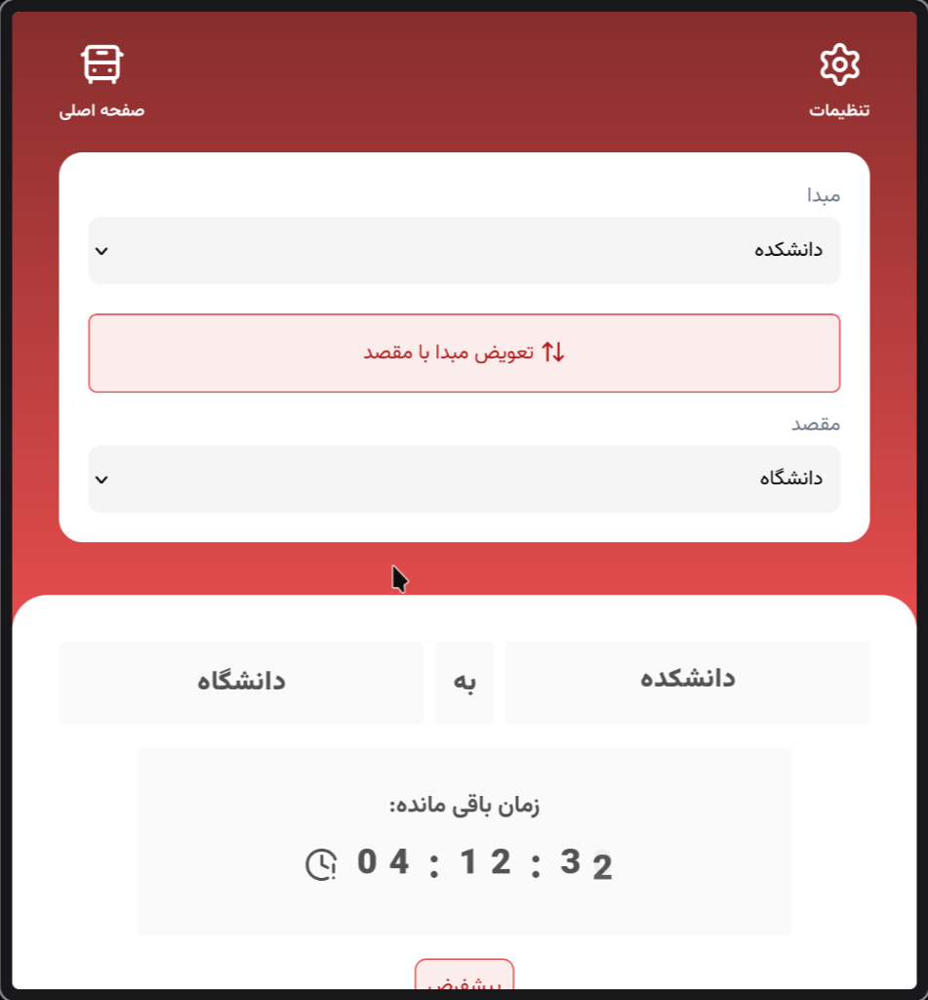

# ON-TIME Bus Tracker



> [Live preview](https://bus.codegeeks.ir)

**ON-TIME** is a bus tracking PWA Built with [Vite](https://vite.dev) , [React](https://react.dev) , [Tailwind](https://tailwindcss.com) , [Motion](https://motion.dev). this is a PWA I created for our university students who had hard time remembering bus stop times (yes, that includes me too!)

## How it works

You choose where you are and where you want to go and it loads the bus stop times for that from an excel file. It shows the remaining time and highlights time it self of the next bus stop.

You can add new set of custom times by creating and uploading it on the internet (even to google sheets with public access) and add it as a repository from the settings.

## Features

- Smooth animations thanks to framer motion
- Changing color on the schedule change
- Define sub-schedules
- Add comments for schedules in the excel file
- Alternate the origin and destination with a click
- Add custom repositories for new schedules
- 24/12hr format
- Dark mode
- Fast origin/destination listing
- Works even offline! / Installable PWA

## Installation

```bash
# clone the repo
git clone git@github.com:codegeeks-ir/on-time.git

# install packages (using pnpm)
pnpm i

# fire up the dev server
pnpm dev

# format code using prettier
pnpm format

# build the project
pnpm build

# if you don't have pnpm installed:
npm install -g pnpm@latest-10
```
